# Plan de implementación: Zep → PostgreSQL + pgvector

## Ubicación y lectura

- Ruta en el repo: `docs/IMPLEMENTATION_ZEP_TO_POSTGRES.md`
- Si al abrirlo ves la pantalla casi vacía: prueba vista **Raw** en GitHub, otro editor, o desactiva plugins que oculten Markdown; las tablas y Mermaid a veces no se pintan en el preview del IDE.

## Resumen ejecutivo (texto plano)

1. Se reemplaza Zep Cloud como almacén y motor de búsqueda del grafo de simulación por PostgreSQL con extensión pgvector, manteniendo el mismo flujo de producto: construir grafo, simular con OASIS, generar informe con herramientas del agente.
2. Durante meses se mantiene Zep en paralelo con un flag de entorno `GRAPH_BACKEND=zep` o `GRAPH_BACKEND=postgres` para rollback y pruebas de paridad.
3. Todo acceso a base de datos va en una carpeta `backend/app/repositories/graph/` (sin SQL en servicios de negocio).
4. El trabajo se divide en fases 0 a 7: entorno local, esquema SQL, repositorios, ingesta de grafo, lectura para simulación, herramientas del Report Agent, memoria dinámica del grafo, perfiles OASIS, observabilidad.
5. La paridad se valida con checklist de API, mismos textos `to_text()` para el agente, y tests golden comparando Zep vs Postgres en grafos de referencia.

## Índice del documento

1. Objetivo y alcance
2. Definición de paridad alta
3. Arquitectura objetivo (diagrama Mermaid)
4. Reglas de proyecto
5. Modelo de datos Postgres
6. Capa de aplicación y mapeo Zep → Postgres
7. Fases 0 a 7 con entregables
8. Validación, riesgos, criterios de salida, checklist

## Objetivo y alcance

- **Objetivo**: conservar la **misma usabilidad y entregables** orientados a predicción con agentes sintéticos (simulación OASIS, lectura de entidades, informes del Report Agent, herramientas de recuperación, construcción de grafo, actualización de memoria de grafo) sustituyendo **Zep Cloud** como backend de **persistencia y recuperación** del mundo simulado.
- **Alcance**: migración **completa** de todo uso de `zep_cloud` en el backend.
- **Estrategia**: **coexistencia prolongada** con selector por entorno (`GRAPH_BACKEND=zep|postgres`) para rollback inmediato y validación de paridad sin romper el flujo actual.

Referencias actuales:

- Config y validación: [backend/app/config.py](backend/app/config.py)
- Construcción de grafo: [backend/app/services/graph_builder.py](backend/app/services/graph_builder.py)
- Lectura de entidades (simulación): [backend/app/services/zep_entity_reader.py](backend/app/services/zep_entity_reader.py), [backend/app/api/simulation.py](backend/app/api/simulation.py)
- Herramientas de informe: [backend/app/services/zep_tools.py](backend/app/services/zep_tools.py), [backend/app/services/report_agent.py](backend/app/services/report_agent.py)
- Memoria dinámica: [backend/app/services/zep_graph_memory_updater.py](backend/app/services/zep_graph_memory_updater.py)
- Paginación Zep: [backend/app/utils/zep_paging.py](backend/app/utils/zep_paging.py)
- API grafo: [backend/app/api/graph.py](backend/app/api/graph.py)
- Dependencia: [backend/pyproject.toml](backend/pyproject.toml) (`zep-cloud`)

## Definición de paridad alta (criterios de equivalencia)

Para `GRAPH_BACKEND=postgres` frente a Zep, en grafos de referencia migrados o duplicados:

| Área | Criterio |
| --- | --- |
| API HTTP | Mismas respuestas observables por el frontend (campos críticos: `graph_id`, conteos, estados de tareas). |
| Simulación | Misma capacidad de leer/filtrar entidades y preparar OASIS. |
| Report Agent | Misma API de herramientas y **formato textual** (`to_text()`) para no romper prompts ni el parsing en [frontend/src/components/Step4Report.vue](frontend/src/components/Step4Report.vue). |
| Temporalidad | Clasificación coherente de hechos **activos vs históricos/expirados** (equivalente a `PanoramaResult` / `EdgeInfo`). |
| Rendimiento local | Latencias aceptables en grafos típicos del equipo (definir SLO en Fase 0). |

## Arquitectura objetivo

```mermaid
flowchart TB
  api[Flask_API_graph_simulation_report] --> svc[GraphApplicationServices]
  svc --> repo[GraphRepositories_Postgres]
  repo --> pg[(Postgres_pgvector)]
  svc --> emb[EmbeddingClient]
  emb --> llmEmb[Embeddings_API]
  svc -->|GRAPH_BACKEND_zep| zep[Zep_Cloud_Legacy]
```

### Reglas de proyecto (obligatorias)

- **Repository**: todo SQL en `backend/app/repositories/graph/` (los servicios de aplicación no ejecutan SQL directo).
- **Excepciones de dominio**: fallos esperados (grafo inexistente, embedding fallido, violación de invariantes) con excepciones propias; lo inesperado con excepciones estándar.
- **Logging**: utilidad estructurada existente (`get_logger`) con `level`, `module`, `function`.
- **Secretos**: `DATABASE_URL`, credenciales de embeddings y LLM solo vía variables de entorno (nunca en código ni en commits).

## Modelo de datos Postgres (mínimo con paridad)

Tablas propuestas (nombres orientativos):

| Tabla | Rol |
| --- | --- |
| `graphs` | `graph_id` (PK), nombre, descripción, `ontology_json`, metadatos, timestamps. |
| `graph_nodes` | Nodos: nombre, `labels`, `summary`, `attributes_json`, correlación opcional `zep_uuid` para migración. |
| `graph_edges` | Aristas: tipo/nombre de relación, `fact_text`, `source_node_id`, `target_node_id`, timestamps `valid_at`, `invalid_at`, `expired_at`. |
| `graph_episodes` | Trazabilidad de lotes de ingesta (equivalente conceptual a episodios Zep). |
| `graph_chunks` | Texto por chunk, hash, `embedding vector(...)`, vínculo a `graph_id` y episodio. |
| Proyecciones de búsqueda | Tablas o vistas materializadas `graph_entity_search` / `graph_fact_search` para top-k semántico con filtros. |

**Índices**: `pgvector` (HNSW/IVFFlat según versión y volumen), btree por `graph_id`, índices temporales; opcional `tsvector` + GIN para híbrido texto.

## Capa de aplicación

1. **`GraphBackend`** (ABC o Protocol) con implementaciones:
   - `ZepGraphBackend`: delegación al código actual (sin cambiar comportamiento).
   - `PostgresGraphBackend`: nueva implementación.
2. **Repositorios** (solo DB): `GraphRepository`, `NodeRepository`, `EdgeRepository`, `ChunkRepository`, `SearchRepository`.
3. **Servicios** (orquestación, sin SQL):
   - `GraphBuildService` (sustituye lógica de construcción hoy acoplada a Zep en [graph_builder.py](backend/app/services/graph_builder.py)).
   - `GraphQueryService` (paridad con [zep_tools.py](backend/app/services/zep_tools.py)).
   - `GraphEntityReadService` (paridad con [zep_entity_reader.py](backend/app/services/zep_entity_reader.py)).
   - `GraphMemoryUpdateService` (paridad con [zep_graph_memory_updater.py](backend/app/services/zep_graph_memory_updater.py)).

### Mapeo funcional Zep → Postgres

| Zep (hoy) | Postgres |
| --- | --- |
| Crear grafo + ontología | Insert en `graphs` + persistencia `ontology_json` |
| Ingesta por chunks/episodios | `graph_episodes` + `graph_chunks` + embeddings |
| Nodos/aristas materializados | Job post-ingesta (LLM + reglas ontológicas) + upsert idempotente |
| Búsqueda semántica | Top-k por similitud + filtro `graph_id` |
| `get_all_nodes` / `get_all_edges` | SQL paginado (reemplazo lógico de [zep_paging.py](backend/app/utils/zep_paging.py)) |
| Estadísticas | `COUNT`, `GROUP BY` sobre nodos/aristas |
| `insight_forge` | Sub-preguntas vía LLM + múltiples consultas + ensamblaje `InsightForgeResult` |
| `panorama_search` | Consultas agregadas + split activo/histórico por timestamps |
| `quick_search` | Consulta acotada (vector y/o full-text) |
| Memoria durante simulación | Inserts/updates + cola de re-embedding |

## Fases de implementación (paridad-first, coexistencia larga)

### Fase 0 — Fundamentos (≈1 semana)

- `docker-compose` local: Postgres con extensión `vector`; documentar en README del backend.
- Variables: `GRAPH_BACKEND`, `DATABASE_URL`, parámetros de embeddings (`EMBEDDING_*` alineados al proveedor que uses).
- Ajustar [config.py](backend/app/config.py): `validate()` exige `ZEP_API_KEY` solo si `GRAPH_BACKEND=zep`; si `postgres`, exige `DATABASE_URL` y credenciales de embeddings.
- Elegir herramienta de migraciones (Alembic o SQL versionado en `backend/migrations/`).

### Fase 1 — Repositorios y CRUD (≈1–2 semanas)

- CRUD de grafos, nodos, aristas; importación batch; tests de integración con Postgres en CI/local.

### Fase 2 — Ingesta equivalente a GraphBuilder (≈2–3 semanas)

- Pipeline: chunking (reutilizar [text_processor.py](backend/app/services/text_processor.py)) → embeddings → `graph_chunks` → materialización de nodos/aristas.
- **Fase A (paridad rápida)**: extracción estructurada con LLM desde chunks.
- **Fase B (refinamiento)**: validación contra `ontology_json` y reglas de tipos/relaciones.
- Integrar en [graph.py](backend/app/api/graph.py) detrás de `GRAPH_BACKEND` sin romper contratos de respuesta.

### Fase 3 — Lectura de entidades para simulación (≈1–2 semanas)

- Portar filtros y selección de [zep_entity_reader.py](backend/app/services/zep_entity_reader.py) a Postgres.
- Integrar en [simulation.py](backend/app/api/simulation.py) manteniendo el mismo comportamiento observable.

### Fase 4 — Paridad Report Agent (≈2–4 semanas)

- Servicio con la **misma API pública** que consume [report_agent.py](backend/app/services/report_agent.py) (inyectable en lugar de `ZepToolsService`).
- Implementar: `insight_forge`, `panorama_search`, `quick_search`, `get_simulation_context`, `get_graph_statistics`, `get_entity_summary`, `get_entities_by_type`, `interview_agents` (este último sigue OASIS; solo asegurar que no dependa de Zep para contexto si aplica).
- Tests **golden**: comparar salidas normalizadas Zep vs Postgres en grafos de referencia.

### Fase 5 — Memoria dinámica del grafo (≈1–2 semanas)

- Portar [zep_graph_memory_updater.py](backend/app/services/zep_graph_memory_updater.py) a escrituras Postgres + cola de re-embeddings.
- Mantener `enable_graph_memory_update` con la misma semántica.

### Fase 6 — OASIS profiles y limpieza de acoplamientos (≈1 semana)

- [oasis_profile_generator.py](backend/app/services/oasis_profile_generator.py): sustituir búsqueda Zep directa por `GraphQueryService`.
- Durante coexistencia prolongada: **no** eliminar `zep-cloud` de [pyproject.toml](backend/pyproject.toml) hasta decisión explícita de cierre; el runtime debe poder operar solo con Postgres cuando `GRAPH_BACKEND=postgres`.

### Fase 7 — Observabilidad y operación (continuo)

- Métricas: latencia por herramienta, tamaño de contexto recuperado, errores de embedding, consistencia de materialización.
- Scripts: export/import de un `graph_id` para pruebas A/B Zep vs Postgres.

## Validación de predicción y entregables

- **Funcional**: recorrer flujos graph → simulation → report con ambos backends.
- **Cualitativo**: mismos hitos en logs del agente y secciones en Step4.
- **Recuperación**: solapamiento top-k de hechos (p. ej. Jaccard) y similitud agregada del bloque de contexto enviado al LLM en escenarios de referencia.

## Riesgos y mitigaciones

| Riesgo | Mitigación |
| --- | --- |
| Extracción de grafo peor que Zep | Segunda pasada de consolidación, validación ontológica, tests golden |
| Coste/latencia de embeddings | Batching, reindex incremental, cache por `graph_id` |
| Errores temporales (activo vs expirado) | Esquema explícito de validez + tests dedicados para `panorama_search` |

## Criterios de salida globales

- `GRAPH_BACKEND=postgres` supera el checklist de paridad en grafos de referencia.
- Entorno local reproducible (docker + env) documentado.
- `GRAPH_BACKEND=zep` sigue operativo para rollback.
- Cumplimiento de reglas: Repository, excepciones de dominio, logging estructurado, secretos solo en entorno.

## Checklist de tareas (resumen)

1. Docker Postgres+pgvector + variables `GRAPH_BACKEND` / `DATABASE_URL` / embeddings.
2. Esquema SQL y migraciones versionadas.
3. Capa `repositories/graph/`.
4. `GraphBackend` Zep vs Postgres; cablear [graph.py](backend/app/api/graph.py).
5. Ingesta y materialización de grafo (paridad con GraphBuilder).
6. Entity reader para [simulation.py](backend/app/api/simulation.py).
7. Herramientas de informe con `to_text()` equivalente.
8. Graph memory updater en Postgres.
9. Perfiles OASIS sin Zep directo.
10. Tests golden + documentación de runbook.

## Documentos relacionados

- [REGLAS_COMPLEMENTO.md](../REGLAS_COMPLEMENTO.md)
- [docs/INDEX_ROADMAPS.md](INDEX_ROADMAPS.md)
