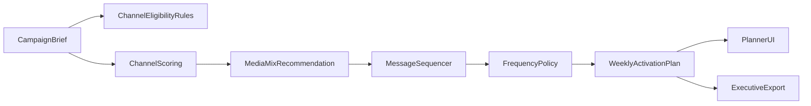

# Roadmap: Planificador de canal y frecuencia

## Nota de prioridad
Este roadmap se ejecuta despues de completar el roadmap de creative testing. Se mantiene como complemento del sistema actual y no reemplaza flujos existentes.

## Objetivo de la funcionalidad
Diseñar e implementar una capacidad complementaria que transforme resultados de simulación en un plan accionable de medios y cadencia: qué canal usar, con qué intensidad, en qué orden y con qué mensaje por etapa del funnel.

## Resultado esperado para el equipo
- Recomendación de `media mix` por segmento.
- Secuencia de mensajes por funnel (awareness, consideration, conversion, retention).
- Frecuencia sugerida por canal, con límites para evitar saturación.
- Plan semanal listo para activación interna.

## Alcance MVP (90 días)
- Entrada: audiencia, objetivo de campaña, presupuesto indicativo, canales habilitados, duración.
- Salida: matriz canal-etapa, secuencia de mensajes, frecuencia recomendada y riesgos de sobreexposición.
- Integración: como módulo adicional del flujo de reporte/creative testing actual.

## Principios de diseño (no regresión)
- Implementación aditiva y opt-in.
- Sin cambios breaking en endpoints o contratos existentes.
- Reuso de resultados ya generados por creative testing/reportes.
- Si falla el módulo, el flujo actual sigue operando.

## Fase 1 (Semanas 1-3): Modelo de entrada y reglas base

### Objetivo
Definir el contrato de planificación de canales y la lógica base de asignación por funnel.

### Entregables
- Esquema de entrada `channel_frequency_plan_request`:
  - `campaign_goal`
  - `audience_profile`
  - `budget_band`
  - `available_channels[]`
  - `funnel_focus`
  - `campaign_duration_weeks`
- Taxonomía unificada de funnel y tipo de mensaje.
- Reglas iniciales de elegibilidad por canal (canal apto por etapa/segmento).

### Criterio de salida
- Se puede generar una primera recomendación estructurada de canales y frecuencia con datos mínimos.

## Fase 2 (Semanas 4-6): Motor de recomendaciones de media mix

### Objetivo
Calcular mezcla de medios por segmento y etapa del funnel.

### Entregables
- Servicio nuevo de recomendación (complementario), p.ej. `channel_mix_service`.
- Scoring por canal:
  - afinidad de audiencia
  - ajuste al objetivo
  - costo relativo
  - riesgo de fatiga
- Salida estructurada:
  - ranking de canales por etapa
  - peso recomendado por canal (porcentaje)
  - justificación por canal

### Criterio de salida
- Recomendación consistente y explicable de media mix por funnel.

## Fase 3 (Semanas 7-9): Secuencia de mensajes y frecuencia

### Objetivo
Definir la cadencia de contactos y el orden de mensajes por semana/funnel.

### Entregables
- Generador de secuencia de mensajes:
  - mensaje principal por etapa
  - variaciones por segmento
  - secuencia temporal (semana 1..N)
- Reglas de frecuencia:
  - frecuencia mínima/óptima/máxima por canal
  - alertas de saturación
  - ventanas de descanso
- Salida operativa:
  - plan editorial y de pauta semanal

### Criterio de salida
- El equipo recibe un calendario accionable de canal + mensaje + frecuencia.

## Fase 4 (Semanas 10-12): UI interna y flujo operativo

### Objetivo
Hacer utilizable el planificador por planner/estratega sin complejidad técnica.

### Entregables
- Vista `Channel Planner` integrada al flujo de creative testing.
- Componentes clave:
  - matriz canal x etapa
  - timeline semanal de mensajes
  - controles de frecuencia por canal
  - panel de riesgos (fatiga/canibalización)
- Export ejecutivo:
  - resumen de plan recomendado
  - supuestos y límites

### Criterio de salida
- Un usuario de negocio puede pasar de inputs a plan de activación en menos de 15 minutos.

## Fase 5 (Semanas 13+): Medición y calibración

### Objetivo
Ajustar recomendaciones con desempeño real de campaña.

### Entregables
- Captura de resultados reales por canal/semana.
- Métricas de calibración:
  - respuesta por frecuencia
  - canal lift por etapa
  - señales de saturación
- Ajuste iterativo de pesos de recomendación.

### Criterio de salida
- El planificador mejora su precisión con cada ciclo de campaña.

## Flujo funcional objetivo

## Backlog priorizado
1. Definir contrato de entrada para planificador de canal/frecuencia.
2. Implementar scoring de canal por etapa de funnel.
3. Implementar generador de secuencia de mensajes.
4. Implementar reglas de frecuencia y alertas de fatiga.
5. Construir UI de matriz + timeline + panel de riesgo.
6. Habilitar export ejecutivo del plan.
7. Añadir captura de resultados reales para calibración.

## Riesgos y mitigaciones
- Riesgo: recomendaciones demasiado genéricas.
  - Mitigación: segmentación obligatoria + justificación por canal.
- Riesgo: sobre-frecuencia por presión de performance.
  - Mitigación: límites duros y alertas de fatiga.
- Riesgo: baja adopción por complejidad de la interfaz.
  - Mitigación: modo básico por defecto y detalle progresivo.

## KPIs de éxito de la funcionalidad
- Tiempo brief -> plan de canales.
- % campañas con planificador usado antes de activación.
- Variación de performance vs baseline sin planificador.
- Reducción de incidencias de fatiga/sobreexposición.
- Satisfacción del equipo interno con claridad de recomendaciones.
