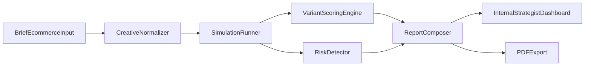

# Roadmap 90 dias: Creative Testing First

## Objetivo
Implementar un flujo de `creative testing` accionable para retail/eCommerce (uso interno), que permita evaluar piezas/mensajes por segmento antes de lanzar campañas y genere decisiones claras de activacion.

## Base actual sobre la que se construye
- El reporte ya tiene pipeline completo de planeacion/generacion y salida incremental en [backend/app/services/report_agent.py](/Users/buentipo/Documents/GitHub/prediction/backend/app/services/report_agent.py).
- Ya existe UI de reporte, timeline de ejecucion y exportacion PDF en [frontend/src/components/Step4Report.vue](/Users/buentipo/Documents/GitHub/prediction/frontend/src/components/Step4Report.vue) y [frontend/src/utils/exportReportPdf.js](/Users/buentipo/Documents/GitHub/prediction/frontend/src/utils/exportReportPdf.js).
- API de reportes y logs ya disponible en [backend/app/api/report.py](/Users/buentipo/Documents/GitHub/prediction/backend/app/api/report.py).

## Alcance del MVP (primeros 90 dias)
- Cargar un `creative brief estructurado` por corrida.
- Evaluar multiples variantes de copy/claim/CTA por audiencia objetivo.
- Obtener ranking de variantes + riesgos + recomendaciones por canal.
- Entregar salida util para planner/estrategia/creativo en menos de 30 minutos por corrida.

## Arquitectura funcional objetivo

## Fase 1 (Semanas 1-3): Fundacion de Creative Testing

### Entregables
- Esquema de entrada estandar para creative testing (brief + audiencia + variantes).
- Nuevo endpoint para iniciar corrida de creative testing.
- Persistencia de metadatos de prueba por variante.
- Plantillas de prompt orientadas a marketing retail/eCommerce.

### Cambios propuestos
- Definir contrato de entrada (`creative_test_request`) en capa API:
  - `business_goal`, `audience_profile`, `scenario`, `creative_variants[]`, `channels[]`, `success_metrics[]`.
- Extender flujo en [backend/app/api/report.py](/Users/buentipo/Documents/GitHub/prediction/backend/app/api/report.py) con ruta dedicada (ej. `/api/report/creative-test/generate`).
- Incorporar un “modo creative testing” en [backend/app/services/report_agent.py](/Users/buentipo/Documents/GitHub/prediction/backend/app/services/report_agent.py) para:
  - Forzar comparacion entre variantes.
  - Requerir evidencia por segmento.
  - Exigir salida accionable (no solo narrativa).
- Añadir archivo de plantilla operativa en repo (ej. `docs/creative-testing-brief-template.md`).

### Criterio de salida de fase
- Se puede correr una prueba con 3-5 variantes y obtener informe comparativo consistente.

## Fase 2 (Semanas 4-7): Scoring, comparacion y decision de campaña

### Entregables
- Modelo de scoring por variante y segmento.
- Matriz de riesgos (reputacional, claridad de mensaje, fatiga/promesa invalida).
- Recomendador de “next best action” por canal.

### Cambios propuestos
- Agregar componente de puntaje en backend (servicio nuevo, p.ej. `creative_scoring_service.py`) con criterios:
  - `message_clarity_score`
  - `audience_fit_score`
  - `conversion_intent_score`
  - `brand_risk_score`
- Extender salida del reporte con bloque estructurado:
  - ranking de variantes
  - ganadora por objetivo
  - riesgos por variante
  - ajustes sugeridos de copy/CTA
- Actualizar la visualizacion en [frontend/src/components/Step4Report.vue](/Users/buentipo/Documents/GitHub/prediction/frontend/src/components/Step4Report.vue):
  - vista “Comparative Results”
  - tarjetas por variante con scores y racional
  - filtros por segmento/canal

### Criterio de salida de fase
- El equipo puede decidir creatividades sin leer todo el log tecnico; solo con scorecard + evidencia.

## Fase 3 (Semanas 8-10): Operacion interna de agencia

### Entregables
- Flujo operativo por roles (planner, estratega, creativo).
- Libreria de audiencias reutilizables retail/eCommerce.
- Plantillas de salida para comite interno de campana.

### Cambios propuestos
- Estandarizar estados de corrida en dashboard (draft, running, review, approved).
- Guardar perfiles de audiencia frecuentes para reuso.
- Exportes de decision listos para presentacion interna (PDF + resumen ejecutivo).
- Ajustes de i18n para etiquetas de negocio en [locales/en.json](/Users/buentipo/Documents/GitHub/prediction/locales/en.json), [locales/es.json](/Users/buentipo/Documents/GitHub/prediction/locales/es.json), [locales/zh.json](/Users/buentipo/Documents/GitHub/prediction/locales/zh.json).

### Criterio de salida de fase
- Proceso repetible semanal por cuenta sin depender de configuraciones ad-hoc.

## Fase 4 (Semanas 11-13): Calibracion y medicion de impacto

### Entregables
- Marco de validacion contra resultados reales de campana.
- Dashboard de calidad del sistema (precision de recomendacion, adopcion interna, tiempo de insight).
- Backlog priorizado para siguiente trimestre.

### Cambios propuestos
- Capturar feedback post-campana en estructura simple (ganadora real vs sugerida).
- Introducir loop de calibracion de pesos del scoring.
- Definir KPIs de producto interno:
  - tiempo brief->decision
  - tasa de adopcion por equipo
  - lift de performance en piezas testeadas

### Criterio de salida de fase
- Evidencia de ROI interno y plan de escalado a cliente-visible (siguiente etapa).

## Backlog priorizado (Creative Testing First)
1. Contrato de entrada de creative testing (schema + validaciones).
2. Endpoint dedicado de ejecucion.
3. Prompt pack retail/eCommerce (copy, CTA, objeciones, tono).
4. Scoring engine por variante/segmento.
5. UI comparativa y ranking.
6. Export ejecutivo para decision interna.
7. Libreria de audiencias reutilizables.
8. Loop de calibracion con resultados reales.

## Riesgos y mitigaciones
- Riesgo: briefs incompletos generan conclusiones debiles.
  - Mitigacion: validaciones obligatorias y plantilla guiada.
- Riesgo: exceso de narrativa y poca accion.
  - Mitigacion: salida estructurada obligatoria (ranking, riesgos, accion).
- Riesgo: baja adopcion interna.
  - Mitigacion: dashboard simplificado por rol + SLA de entrega (<30 min).

## Hitos de exito al dia 90
- 80% de corridas internas usan plantilla estructurada.
- 70% de decisiones creativas relevantes pasan por creative testing.
- Reduccion medible del tiempo de analisis pre-lanzamiento.
- Scorecard utilizado como fuente principal en comite interno de campana.
